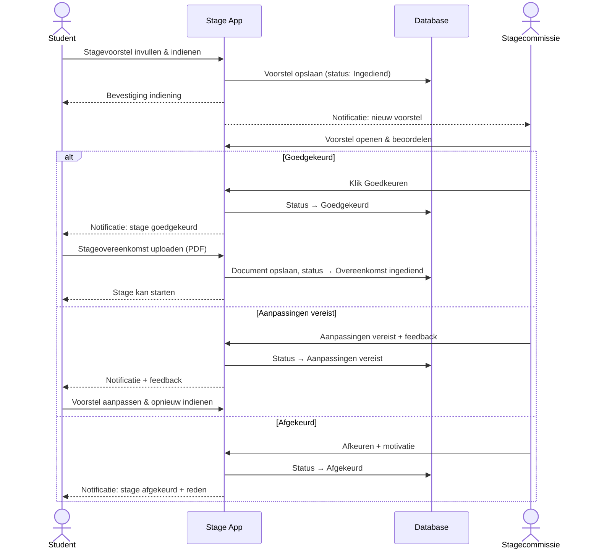
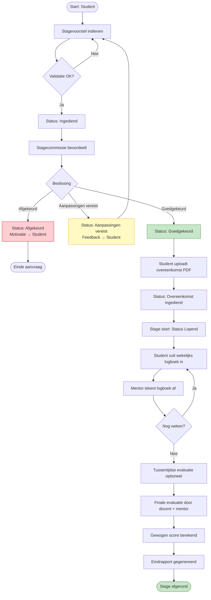
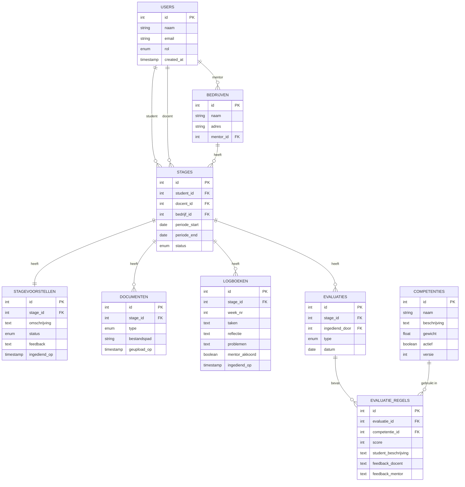

# STAGE MONITORING TOOL

Analyse Document - Juan Benjumea  
Projectanalyse – 14/3/2026

## 1. Intro

### 1.1 Fasen in het proces

1. **Aanvraag**
   - Inhoud: Gegevens van student, bedrijf, stageperiode en een beschrijving van de stage.
   - Status: Aangemaakt en Ingediend.

2. **Beoordeling** (door Stagecommissie)
   - Status: Goedgekeurd, Afgekeurd of Aanpassingen vereist.

3. **Overeenkomst en Administratie**
   - Acties: Ondertekening van de overeenkomst en regelen van de verzekering.
   - Status: Goedgekeurd (na ondertekening en verzekering).

4. **Wekelijkse Opvolging**
   - Instrumenten: Logboek (met Taken, Reflectie en eventuele Problemen).
   - Actie: Wekelijkse check-up (tussen Docent, Bedrijfsmentor en Student).

5. **Eindevaluatie**
   - Componenten: Score, Feedback, Reflectieverslag en Eindpresentatie.
   - Scoring: Flexibel qua aantal, inhoud en weging; beoordeling per competentie.

### 1.2 Basisvereisten

De volgende basisvereisten zijn geïdentificeerd:

- Documentopslag
- Flexibele criteria
- Toegang op basis van rollen
  1. Student
  2. Stagecommissie
  3. Docent
  4. Stagementor
  5. Administratie

## 2. Functionele Analyse per Fase

### Fase 1 & 2: Aanvraag & Goedkeuringsflow

Het systeem fungeert hier als een transactie-logboek.

- **Input:** Multipart-form voor studentdata en bedrijfsgegevens.
- **Logica:** Rollen-gebaseerde toegang (RBAC). Alleen de stagecommissie heeft WRITE-rechten op de status van een aanvraag.
- **Feedback-loop:** Bij de status "Aanpassingen vereist" moet het systeem een differentiële notificatie sturen naar de student.

### Fase 3: Documentbeheer

Gezien de juridische waarde van de stageovereenkomst:

- **Integriteit:** Implementeer versiebeheer op opgeladen PDF-bestanden.
- **Validatie:** Een stage kan pas overgaan naar de status "Actief" (Fase 4) nadat de vlag `overeenkomst_getekend` op true staat.

### Fase 4: Wekelijkse Logboeken (Monitoring)

Dit is de operationele hartslag van de tool.

- **Interface:** Een dashboard voor de mentor/docent met een overzicht van "Missing Logs".
- **Interactie:** Mogelijkheid voor 'inline' commentaren van de mentor op specifieke logboekitems.

### Fase 5: Dynamische Evaluatie

Op basis van de geüploade afbeeldingen met competenties (zoals "Analyseren", "Ontwerpen", "Realiseren"), moet de datastructuur er als volgt uitzien:

| Entiteit | Eigenschappen |
|---|---|
| CompetentieProfiel | Naam, Versie (bijv. "Toegepaste Informatica 2026") |
| Competentie | Naam, Omschrijving, Gewicht ($w_i$), Type (Soft skill / Hard skill) |
| EvaluatieMoment | Type (Tussentijds/Finaal), Datum, Deelnemers |
| Score | Link naar Student + Competentie + EvaluatieMoment, Waarde, Verantwoording |

## 3. User Stories

De onderstaande user stories beschrijven de functionele vereisten vanuit het perspectief van elke actor. Ze volgen het formaat: Als [rol] wil ik [actie] zodat [doel].

| ID | User Story | Prioriteit | Procesfase |
|---|---|---|---|
| **Rol: Student** | | | |
| US-01 | Als student wil ik een stagevoorstel kunnen indienen met bedrijfs- en opdrachtgegevens zodat de stagecommissie mijn stage kan beoordelen. | Must Have | Aanvraag |
| US-02 | Als student wil ik de status van mijn stagevoorstel kunnen bekijken zodat ik weet of mijn stage goedgekeurd is. | Must Have | Beoordeling |
| US-03 | Als student wil ik feedback ontvangen bij afkeuring of gevraagde aanpassingen zodat ik mijn voorstel kan verbeteren. | Must Have | Beoordeling |
| US-04 | Als student wil ik een getekende stageovereenkomst kunnen uploaden om de stage administratief en voor de verzekering in orde te maken. | Must Have | Overeenkomst |
| US-05 | Als student wil ik wekelijks een logboek kunnen invullen met taken en reflecties zodat mijn docent en mentor mijn voortgang kunnen volgen. | Must Have | Opvolging |
| US-06 | Als student wil ik per competentie mijn vorderingen kunnen beschrijven zodat de evaluatie transparant verloopt. | Must Have | Opvolging |
| US-07 | Als student wil ik feedback van mijn docent/mentor kunnen lezen zodat ik weet hoe ik presteer. | Must Have | Opvolging |
| US-08 | Als student wil ik een overzicht zien van alle ingevulde logboeken zodat ik mijn eigen evolutie kan volgen. | Should Have | Opvolging |
| US-09 | Als student wil ik een eindevaluatierapport kunnen bekijken zodat ik mijn finale beoordeling kan inzien. | Should Have | Evaluatie |
| **Rol: Stagecommissie** | | | |
| US-10 | Als stagecommissielid wil ik een lijst van ingediende stagevoorstellen zien zodat ik deze kan beoordelen. | Must Have | Aanvraag |
| US-11 | Als stagecommissielid wil ik aanvragen goedkeuren, afkeuren of van feedback voorzien, zodat de kwaliteit van de stage gewaarborgd blijft. | Must Have | Beoordeling |
| US-12 | Als stagecommissielid wil ik feedback kunnen meegeven bij een beslissing zodat de student weet wat er moet veranderen. | Must Have | Beoordeling |
| US-13 | Als stagecommissielid wil ik kunnen controleren of de stageovereenkomst is opgeladen zodat de verzekering gegarandeerd is. | Must Have | Overeenkomst |
| US-14 | Als stagecommissielid wil ik een overzicht van alle stagestudenten en hun status zien zodat ik het stageproces kan monitoren. | Should Have | Opvolging |
| **Rol: Docent** | | | |
| US-15 | Als docent wil ik de wekelijkse logboeken van mijn studenten kunnen inzien en afvinken zodat ik student gericht kan bijsturen. | Must Have | Opvolging |
| US-16 | Als docent wil ik feedback kunnen geven op de competenties van mijn studenten zodat zij weten hoe ze presteren. | Must Have | Opvolging |
| US-17 | Als docent wil ik een tussentijdse evaluatie kunnen registreren zodat er formele feedbackmomenten zijn. | Must Have | Opvolging |
| US-18 | Als docent wil ik de finale evaluatie kunnen invullen en een score toekennen per competentie zodat de eindbeoordeling correct is. | Must Have | Evaluatie |
| US-19 | Als docent wil ik een eindoverzicht per student kunnen genereren zodat ik een rapport heb voor de administratie. | Must Have | Evaluatie |
| US-20 | Als docent wil ik een notificatie ontvangen wanneer een student een nieuw logboek indient zodat ik tijdig kan reageren. | Should Have | Opvolging |
| **Rol: Stagementor** | | | |
| US-21 | Als stagementor wil ik wekelijks de logboeken van mijn stagiair kunnen inkijken zodat ik de voortgang kan valideren. | Must Have | Opvolging |
| US-22 | Als stagementor wil ik logboeken wekelijks kunnen aftekenen zodat de student bewijs heeft van opvolging. | Must Have | Opvolging |
| US-23 | Als stagementor wil ik feedback kunnen geven per competentie zodat de eindbeoordeling volledig is. | Must Have | Evaluatie |
| US-24 | Als stagementor wil ik een overzicht zien van de stage-informatie (periode, opdracht) zodat ik de context goed ken. | Should Have | Aanvraag |
| **Rol: Administratie** | | | |
| US-25 | Als administrator wil ik competenties en wegingen kunnen aanmaken, bewerken en verwijderen zonder code-wijzigingen zodat het evaluatiesysteem flexibel blijft, om in te spelen op beleidswijzigingen. | Must Have | Evaluatie / Opvolging |
| US-26 | Als administrator wil ik het gewicht van competenties kunnen instellen zodat de eindscore correct berekend wordt. | Must Have | Evaluatie |
| US-27 | Als administrator wil ik gebruikers kunnen beheren (studenten, docenten, mentoren) zodat toegang correct wordt geregeld. | Must Have | Alle |
| US-28 | Als administrator wil ik rapportages kunnen exporteren zodat ik data kan gebruiken voor rapportering. | Could Have | Evaluatie |

### Prioriteitsschaal (MoSCoW)

| Prioriteit | Betekenis |
|---|---|
| Must Have | Kritisch – zonder dit werkt het systeem niet. |
| Should Have | Belangrijk – sterke meerwaarde maar niet blokkerend. |
| Could Have | Wenselijk – als er tijd over is. |
| Won't Have | Buiten scope voor dit project. |

## 4. Analyse Rollen

| Rol | Stageaanvraag | Beoordeling | Overeenkomst | Logboeken | Evaluatie (Score) | Configuratie (Systeem) |
|---|---|---|---|---|---|---|
| Student | Create / Read | Read | Upload / Read | Create / Read | Read / Self-reflect | None |
| Commissie | Read / Update (Status) | Create / Read / Update | Read | Read | Read | None |
| Docent | Read | Read | Read | Read / Comment | Create / Update | None |
| Stagementor | Read | Read | Read | Read / Verify | Create / Update | None |
| Beheerder | Read / Delete | Read | Read | Read | Read | Full Access (CRUD) |

## 5. Product Backlog

De product backlog groepeert alle user stories per sprint/fase.

**Sprint 1 – Kerninfrastructuur & Stagevoorstel:** Bevat gebruikersbeheer (rollen/rechten), en het volledige proces voor het indienen, bekijken, goedkeuren/afkeuren en feedback geven op stagevoorstellen (door Student en Stagecommissie).

**Sprint 2 – Stageovereenkomst & Logboeken:** Omvat het uploaden van de stageovereenkomst (Student/Stagecommissie), en het wekelijks invullen, inzien en aftekenen van logboeken (Student/Docent/Stagementor), inclusief een overzicht voor de student.

**Sprint 3 – Evaluaties & Competenties:** Bevat het CRUD-beheer van competenties en het instellen van gewichten (Admin). Ook het beschrijven van vorderingen en feedback geven op competenties (Student/Docent/Stagementor), en het registreren van tussentijdse en finale evaluaties met score/eindoverzicht (Docent).

**Sprint 4 – Meldingen, Rapportage & Afwerking:** Bevat het lezen van feedback/eindevaluatierapport (Student), overzichten van stagestudenten (Stagecommissie) en stage-informatie (Stagementor), notificaties bij nieuwe logboeken (Docent) en het exporteren van rapportages (Admin).

## 6. Acceptatiecriteria

De acceptatiecriteria definiëren wanneer een user story als 'gedaan' beschouwd wordt. Hieronder volgen de criteria voor de meest kritische stories.

**US-01 – Indienen stagevoorstel**

- ✓ Het formulier bevat verplichte velden: studentgegevens, bedrijfsgegevens, docentgegevens, omschrijving opdracht, periode.
- ✓ Alle verplichte velden worden gevalideerd voor indiening.
- ✓ Na indienen krijgt de stage automatisch de status 'Ingediend – wachtend op goedkeuring'.
- ✓ De student ontvangt een bevestigingsmelding na succesvolle indiening.
- ✓ De stagecommissie ontvangt een notificatie van het nieuwe voorstel.

**US-04 – Opladen stageovereenkomst**

- ✓ Enkel PDF-bestanden worden geaccepteerd.
- ✓ Het systeem slaat de uploaddatum op.
- ✓ Na upload wijzigt de status naar 'Overeenkomst ingediend'.
- ✓ De stagecommissie kan de overeenkomst downloaden en valideren.
- ✓ Documenten zijn enkel toegankelijk voor bevoegde rollen.

**US-05 – Wekelijks logboek invullen**

- ✓ Het logboek bevat velden: weeknummer, beschrijving taken, reflectie, problemen/leerpunten.
- ✓ Een logboek kan slechts één keer per week per student worden ingediend.
- ✓ Na indiening zijn de logboeken zichtbaar voor de toegewezen docent en stagementor.
- ✓ De mentor kan het logboek wekelijks aftekenen (valideren).
- ✓ Niet-ingevulde weken worden gemarkeerd als 'Ontbrekend'.

**US-11 – Beoordeling stagevoorstel**

- ✓ De stagecommissie kan kiezen uit: Goedgekeurd, Afgekeurd, Aanpassingen vereist.
- ✓ Bij 'Aanpassingen vereist' is een feedbacktekstveld verplicht.
- ✓ De student ontvangt een notificatie bij elke statuswijziging.
- ✓ Een goedgekeurde stage kan niet meer worden afgekeurd zonder herbeoordelingsflow.
- ✓ Alle beslissingen worden opgeslagen met tijdstempel en gebruiker.

**US-17 – Tussentijdse evaluatie**

- ✓ De docent kan een tussentijds gesprek registreren met datum en opmerkingen.
- ✓ Een optionele tussentijdse score per competentie kan worden toegevoegd.
- ✓ De student kan de tussentijdse evaluatie inzien maar niet bewerken.
- ✓ Er kan meer dan één tussentijdse evaluatie worden geregistreerd per stage.
- ✓ De tussentijdse evaluaties zijn zichtbaar in het eindoverzicht.

**US-18 – Finale evaluatie**

- ✓ Elke actieve competentie heeft een scoreformulier (1–5 sterren of percentagebased).
- ✓ De docent en mentor kunnen onafhankelijk van elkaar scoren.
- ✓ De gewogen eindscore wordt automatisch berekend op basis van competentiegewichten.
- ✓ Na afsluiting kan de evaluatie niet meer worden gewijzigd.
- ✓ Een eindrapport wordt automatisch aangemaakt per student.

**US-25 – Competenties beheren**

- ✓ Competenties hebben naam, beschrijving en gewicht (procentueel, totaal = 100%).
- ✓ Het systeem valideert dat de som van gewichten 100% is bij opslaan.
- ✓ Competenties kunnen worden geactiveerd of gedeactiveerd (niet hardverwijderd).
- ✓ Wijzigingen in competenties gelden enkel voor nieuwe stageperiodes.
- ✓ Historische evaluaties worden niet beïnvloed door competentiewijzigingen.

Elke user story is pas 'Done' als aan de volgende algemene criteria is voldaan:

- De code is gereviewed door minstens één teamlid.
- Er zijn unit- en/of integratietests geschreven en geslaagd.
- De functionaliteit is getest op alle ondersteunde browsers/apparaten.
- Alle validaties en foutmeldingen zijn geïmplementeerd.
- De UI stemt overeen met het prototype.
- Documentatie is bijgewerkt waar nodig.

## 7. Schema's

### 7.1 Actoren & Rollen

De applicatie kent de volgende actoren met hun respectieve toegangsrechten:

| Actor | Verantwoordelijkheden |
|---|---|
| Student | Stagevoorstel indienen, overeenkomst uploaden, logboeken invullen, competenties beschrijven, evaluaties bekijken. |
| Stagecommissie | Voorstellen beoordelen, overeenkomsten valideren, algemeen overzicht beheren. |
| Docent (EhB) | Studenten opvolgen, logboeken inkijken, tussentijdse en finale evaluaties invullen, eindrapport genereren. |
| Stagementor | Logboeken wekelijks aftekenen, feedback geven per competentie. |
| Administratie | Gebruikersbeheer, competentieprofielen beheren, rapportages exporteren. |

### 7.2 Architectuuroverzicht

De applicatie volgt een gelaagde architectuur:

| Laag | Beschrijving |
|---|---|
| Frontend (UI) | Web-applicatie (React/Vue). Responsive interface voor alle rollen. Component library (zoals Tailwind) om interface consistent te houden over alle rollen heen. Communicatie via REST API. |
| Backend (API) | REST API (Node.js/FastApi). Business logic, authenticatie (JWT/OAuth), autorisatie per rol. |
| Database | Relationele database (MySQL/PostgreSQL). Opslag van gebruikers, stages, logboeken, competenties, evaluaties, documenten. |
| Notificatieservice | E-mailnotificaties bij statuswijzigingen, nieuwe logboeken en evaluatiedeadlines. |

### 7.3 Statemodel – Stagevoorstel

Een stagevoorstel doorloopt de volgende statussen:

| Status | Triggerende Actie | Volgende stap |
|---|---|---|
| Ingediend | Student dient in | Stagecommissie beoordeelt het voorstel. |
| In Beoordeling | Commissie opent | Commissie kiest: Goedgekeurd / Afgekeurd / Aanpassingen. |
| Aanpassingen Vereist | Commissie vraagt aan | Student past voorstel aan en dient opnieuw in. |
| Afgekeurd | Commissie keurt af | Student kan een nieuw voorstel indienen. |
| Goedgekeurd | Commissie keurt goed | Student uploadt stageovereenkomst. |
| Overeenkomst Ingediend | Student uploadt | Stage kan officieel van start gaan. |
| Lopend | Stage gestart | Wekelijkse logboeken; tussentijdse evaluaties. |
| Afgerond | Finale evaluatie ingediend | Eindrapport beschikbaar. |

### 7.4 Database Schema (ERD – Hoofdentiteiten)

Hieronder volgt een beschrijving van de kerntabellen en hun relaties. Een volledig ERD-diagram is opgenomen als bijlage.

| Tabel | Sleutelvelden | Relaties |
|---|---|---|
| users | id, naam, email, rol (enum), created_at | 1 user → meerdere stages (als student, docent, of mentor) |
| stages | id, student_id, docent_id, bedrijf_id, periode_start, periode_end, status, metadata, created_at | Behoort toe aan 1 student; heeft 1 docent; behoort tot 1 bedrijf |
| bedrijven | id, naam, adres, sector, mentor_id | 1 bedrijf → meerdere stages; heeft 1 mentor (via users) |
| stagevoorstellen | id, stage_id, omschrijving, status, feedback, ingediend_op | 1-op-1 met stage; heeft status-history |
| logboeken | id, stage_id, week_nr, taken, reflectie, problemen, ingediend_op, mentor_akkoord | Meerdere logboeken per stage; gevalideerd door mentor |
| competenties | id, naam, beschrijving, gewicht, actief, versie | Gekoppeld aan evaluatieperiodes; niet hardcoded |
| evaluaties | id, stage_id, type (tussentijds/finaal), datum, ingediend_door | 1 stage → meerdere evaluaties; bevat evaluatieregels |
| evaluatie_regels | id, evaluatie_id, competentie_id, score, student_beschrijving, feedback_docent, feedback_mentor | Per competentie 1 regel per evaluatie |
| documenten | id, stage_id, type (overeenkomst/bijlage), bestandspad, geüpload_op | Meerdere documenten per stage |

### 7.5 Sequentiediagram – Stageaanvraagflow

Het stageproces (Fase 1 t/m 5) moet worden gemodelleerd als een state machine. Dit maakt het eenvoudig om tussenstappen (zoals een extra goedkeuringsronde) toe te voegen zonder de kernlogica te breken.

Onderstaand is de stap-voor-stap flow voor de aanvraag en goedkeuring van een stage:

| # | Actor | Systeem | Actie / Bericht |
|---|---|---|---|
| 1 | Student | Stage App | Student vult het stageformulier in en klikt op 'Indienen'. |
| 2 | | Stage App | Validatie van verplichte velden. Status → 'Ingediend'. |
| 3 | | Stage App | Notificatie verstuurd naar stagecommissie. |
| 4 | Stagecommissie | | Commissie opent aanvraag en beoordeelt het voorstel. |
| 5a | Stagecommissie | Stage App | [Goedgekeurd] Status → 'Goedgekeurd'. Notificatie naar student. |
| 5b | Stagecommissie | Stage App | [Aanpassingen] Status → 'Aanpassingen vereist'. Feedback meegestuurd naar student. |
| 5c | Stagecommissie | Stage App | [Afgekeurd] Status → 'Afgekeurd'. Motivatie meegestuurd naar student. |
| 6 | Student | Stage App | [Na goedkeuring] Student uploadt stageovereenkomst (PDF). |
| 7 | | Stage App | Systeem registreert document. Status → 'Overeenkomst ingediend'. Stage van start. |

### 7.6 Sequentiediagram – Wekelijks Logboek

| # | Actor | Systeem | Actie / Bericht |
|---|---|---|---|
| 1 | Student | Stage App | Student vult logboek in: taken, reflectie, problemen. |
| 2 | | Stage App | Systeem slaat logboek op met weeknummer en timestamp. |
| 3 | | Stage App | Notificatie verstuurd naar docent en stagementor. |
| 4 | Docent / Mentor | | Docent/mentor bekijkt het logboek via dashboard. |
| 5 | Stagementor | Stage App | Mentor tekent logboek af (wekelijkse validatie). |
| 6 | Docent | Stage App | Docent kan opmerking of feedback toevoegen (optioneel). |

### 7.7 Opmerking over UML Class Diagram & ERD

Een volledig UML Class Diagram en ERD zijn opgebouwd op basis van de entiteiten in sectie 7.4. De volgende klassen zijn aanwezig in het domeinmodel:

- **User (abstract)** → Student, Docent, Stagecommissielid, Stagementor, Admin
- **Stage** → StageVoorstel, StageOvereenkomst
- **Logboek** → LogboekRegel
- **Evaluatie (abstract)** → TussentijdseEvaluatie, FinaleEvaluatie
- **EvaluatieRegel** → Competentie
- **Bedrijf** → Stagementor

**Relaties:**

- Student heeft meerdere Stages (1..n)
- Stage heeft meerdere Logboeken (0..n)
- Stage heeft meerdere Evaluaties (0..n)
- Evaluatie heeft meerdere EvaluatieRegels (1..n per actieve Competentie)
- Bedrijf heeft meerdere Stages (0..n)
