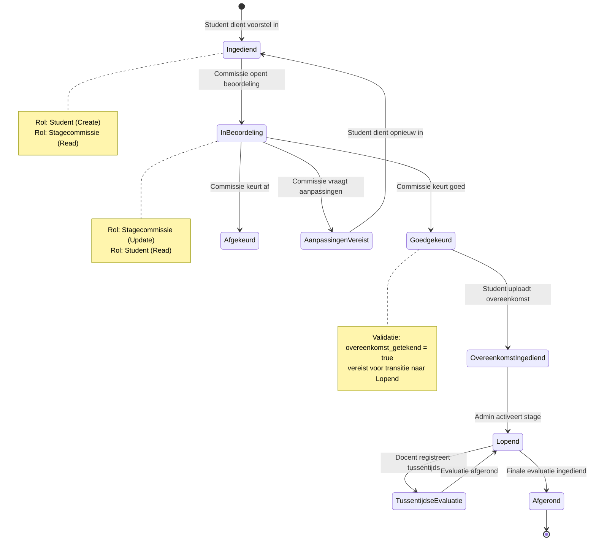
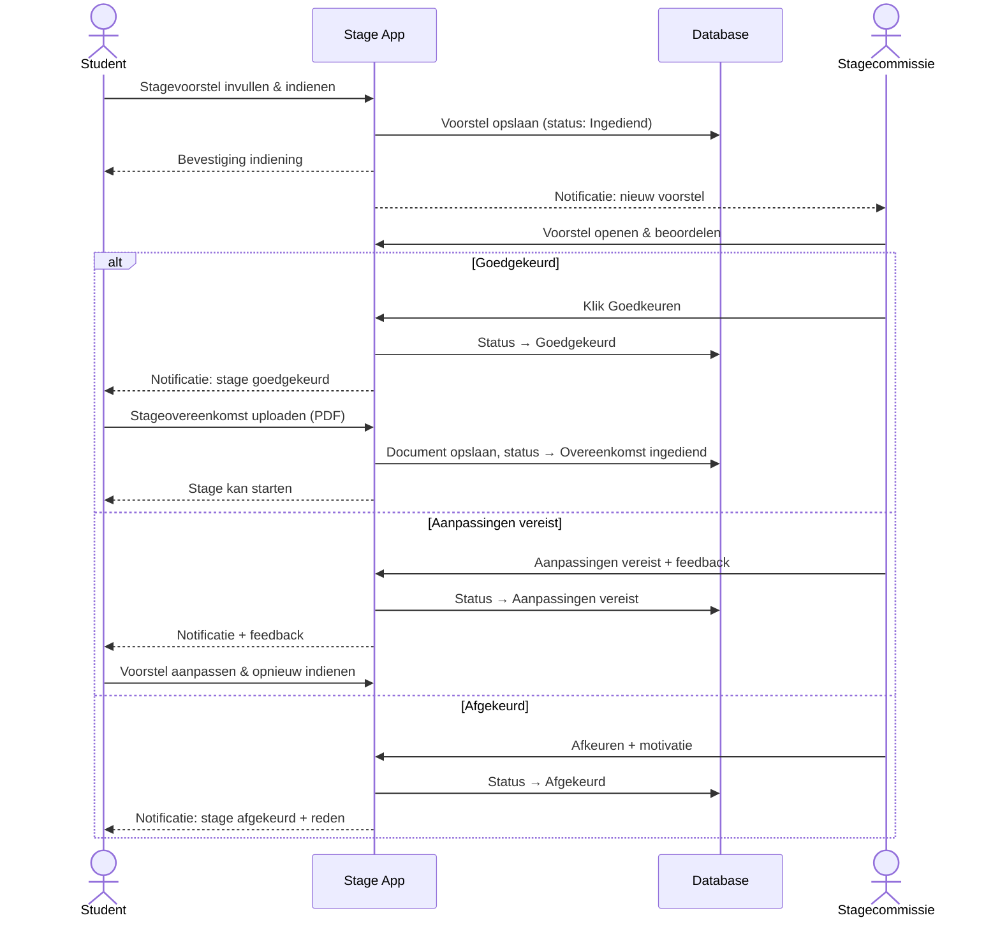
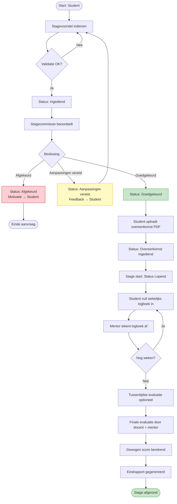
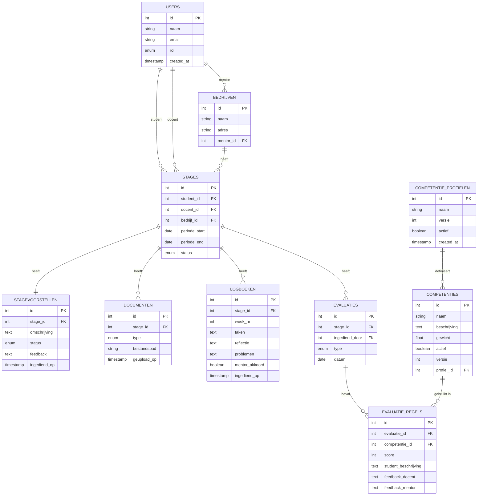

# STAGE MONITORING TOOL

Analyse Document - Juan Benjumea  
Projectanalyse – 14/3/2026

## 1. Intro

### 1.0 Probleemcontext

Het huidige stageproces kent de volgende pijnpunten die de applicatie moet oplossen:

| Pijnpunt | Beschrijving |
|----------|--------------|
| **Versnippering** | Documenten en communicatie verlopen via verschillende platformen (e-mail,纸质 formulieren). |
| **Beperkte transparantie** | Geen centraal overzicht van stagevoorstellen en statussen voor stakeholders. |
| **Inefficiënte communicatie** | Intensief mailverkeer tussen student, stagecommissie, docent en bedrijf. |
| **Handmatige opvolging** | Wekelijkse logboeken worden manueel verwerkt en opgevolgd. |
| **Statische evaluatiecriteria** | Wijzigingen in competenties vereisen telkens code-wijzigingen. |

De Stage Monitoring Tool biedt een centrale, geïntegreerde oplossing voor al deze problemen.

### 1.1 Fasen in het proces

1. **Aanvraag**
   - Inhoud: Gegevens van student, bedrijf, stageperiode en een beschrijving van de stage.
   - Status: Aangemaakt en Ingediend.

2. **Beoordeling** (door Stagecommissie)
   - Status: Goedgekeurd, Afgekeurd of Aanpassingen vereist.

3. **Overeenkomst en Administratie**
   - Acties: Ondertekening van de overeenkomst en regelen van de verzekering.
   - Status: Goedgekeurd (na ondertekening en verzekering).

4. **Wekelijkse Opvolging**
   - Instrumenten: Logboek (met Taken, Reflectie en eventuele Problemen).
   - Actie: Wekelijkse check-up (tussen Docent, Bedrijfsmentor en Student).

5. **Eindevaluatie**
   - Componenten: Score, Feedback, Reflectieverslag en Eindpresentatie.
   - Scoring: Flexibel qua aantal, inhoud en weging; beoordeling per competentie.

### 1.2 Basisvereisten

De volgende basisvereisten zijn geïdentificeerd:

- Documentopslag
- Flexibele criteria
- Toegang op basis van rollen
  1. Student
  2. Stagecommissie
  3. Docent
  4. Stagementor
  5. Administratie

### 1.3 Doelstelling

De Stage Monitoring Tool heeft als primaire doelstellingen:

| # | Doelstelling | Uitleg |
|---|--------------|--------|
| 1 | **Centralisatie** | Alle stagegerelateerde documenten en communicatie op één platform. |
| 2 | **Transparantie** | Duidelijke inzage in status en voortgang voor alle stakeholders. |
| 3 | **Efficiëntie** | Geautomatiseerde notificaties en validaties. |
| 4 | **Wendbaarheid** | Flexibele evaluatiecriteria die zonder code-wijzigingen aanpasbaar zijn. |
| 5 | **Traceerbaarheid** | Audit trail van alle acties en beslissingen. |

## 1.4 Procesmatrix

Fase	Hoofdactor(en)	Secundaire Actor	Systeemactie / Output	Wendbaarheid (Flexibiliteit)
1. Aanvraag	Student	-	Genereert uniek Dossier-ID	Velden (bijv. extra bedrijfsdata) zijn via Admin-paneel aanpasbaar.
2. Beoordeling	Commissie	Student	Status-update + Notificatie flow	Workflow-paden (bijv. extra goedkeuringsstap) zijn configureerbaar.
3. Administratie	Administratie	Student	Validatie overeenkomst_getekend	Support voor diverse documenttypes (PDF, e-sign links).
4. Opvolging	Student	Mentor / Docent	Dashboard: "Missing Logs"	Reflectievragen in logboek kunnen per academiejaar wijzigen.
5. Evaluatie	Mentor / Docent	Student	Scoreberekening ∑(scorei​⋅wi​)	Maximale flexibiliteit: Competenties en wegingen (wi​) zijn 100% datadriven.

### Fase 1 & 2: Aanvraag & Goedkeuringsflow

Het systeem fungeert hier als een transactie-logboek.

- **Input:** Multipart-form voor studentdata en bedrijfsgegevens.
- **Logica:** Rollen-gebaseerde toegang (RBAC). Alleen de stagecommissie heeft WRITE-rechten op de status van een aanvraag.
- **Feedback-loop:** Bij de status "Aanpassingen vereist" moet het systeem een differentiële notificatie sturen naar de student.

### Fase 3: Documentbeheer

Gezien de juridische waarde van de stageovereenkomst:

- **Integriteit:** Implementeer versiebeheer op opgeladen PDF-bestanden.
- **Validatie:** Een stage kan pas overgaan naar de status "Actief" (Fase 4) nadat de vlag `overeenkomst_getekend` op true staat.

### Fase 4: Wekelijkse Logboeken (Monitoring)

Dit is de operationele hartslag van de tool.

- **Interface:** Een dashboard voor de mentor/docent met een overzicht van "Missing Logs".
- **Interactie:** Mogelijkheid voor 'inline' commentaren van de mentor op specifieke logboekitems.

### Fase 5: Dynamische Evaluatie

Op basis van de geüploade afbeeldingen met competenties (zoals "Analyseren", "Ontwerpen", "Realiseren"), moet de datastructuur er als volgt uitzien:

| Entiteit | Eigenschappen |
|---|---|
| CompetentieProfiel | Naam, Versie (bijv. "Toegepaste Informatica 2026") |
| Competentie | Naam, Omschrijving, Gewicht ($w_i$), Type (Soft skill / Hard skill) |
| EvaluatieMoment | Type (Tussentijds/Finaal), Datum, Deelnemers |
| Score | Link naar Student + Competentie + EvaluatieMoment, Waarde, Verantwoording |

## 2. User Stories

De onderstaande user stories beschrijven de functionele vereisten vanuit het perspectief van elke actor. Ze volgen het formaat: Als [rol] wil ik [actie] zodat [doel].

| ID | User Story | Prioriteit | Procesfase |
|---|---|---|---|
| **Rol: Student** | | | |
| US-01 | Als student wil ik een stagevoorstel kunnen indienen met bedrijfs- en opdrachtgegevens zodat de stagecommissie mijn stage kan beoordelen. | Must Have | Aanvraag |
| US-02 | Als student wil ik de status van mijn stagevoorstel kunnen bekijken zodat ik weet of mijn stage goedgekeurd is. | Must Have | Beoordeling |
| US-03 | Als student wil ik feedback ontvangen bij afkeuring of gevraagde aanpassingen zodat ik mijn voorstel kan verbeteren. | Must Have | Beoordeling |
| US-04 | Als student wil ik een getekende stageovereenkomst kunnen uploaden om de stage administratief en voor de verzekering in orde te maken. | Must Have | Overeenkomst |
| US-05 | Als student wil ik wekelijks een logboek kunnen invullen met taken en reflecties zodat mijn docent en mentor mijn voortgang kunnen volgen. | Must Have | Opvolging |
| US-06 | Als student wil ik per competentie mijn vorderingen kunnen beschrijven zodat de evaluatie transparant verloopt. | Must Have | Opvolging |
| US-07 | Als student wil ik feedback van mijn docent/mentor kunnen lezen zodat ik weet hoe ik presteer. | Must Have | Opvolging |
| US-08 | Als student wil ik een overzicht zien van alle ingevulde logboeken zodat ik mijn eigen evolutie kan volgen. | Should Have | Opvolging |
| US-09 | Als student wil ik een eindevaluatierapport kunnen bekijken zodat ik mijn finale beoordeling kan inzien. | Should Have | Evaluatie |
| **Rol: Stagecommissie** | | | |
| US-10 | Als stagecommissielid wil ik een lijst van ingediende stagevoorstellen zien zodat ik deze kan beoordelen. | Must Have | Aanvraag |
| US-11 | Als stagecommissielid wil ik aanvragen goedkeuren, afkeuren of van feedback voorzien, zodat de kwaliteit van de stage gewaarborgd blijft. | Must Have | Beoordeling |
| US-12 | Als stagecommissielid wil ik feedback kunnen meegeven bij een beslissing zodat de student weet wat er moet veranderen. | Must Have | Beoordeling |
| US-13 | Als stagecommissielid wil ik kunnen controleren of de stageovereenkomst is opgeladen zodat de verzekering gegarandeerd is. | Must Have | Overeenkomst |
| US-14 | Als stagecommissielid wil ik een overzicht van alle stagestudenten en hun status zien zodat ik het stageproces kan monitoren. | Should Have | Opvolging |
| **Rol: Docent** | | | |
| US-15 | Als docent wil ik de wekelijkse logboeken van mijn studenten kunnen inzien en afvinken zodat ik student gericht kan bijsturen. | Must Have | Opvolging |
| US-16 | Als docent wil ik feedback kunnen geven op de competenties van mijn studenten zodat zij weten hoe ze presteren. | Must Have | Opvolging |
| US-17 | Als docent wil ik een tussentijdse evaluatie kunnen registreren zodat er formele feedbackmomenten zijn. | Must Have | Opvolging |
| US-18 | Als docent wil ik de finale evaluatie kunnen invullen en een score toekennen per competentie zodat de eindbeoordeling correct is. | Must Have | Evaluatie |
| US-19 | Als docent wil ik een eindoverzicht per student kunnen genereren zodat ik een rapport heb voor de administratie. | Must Have | Evaluatie |
| US-20 | Als docent wil ik een notificatie ontvangen wanneer een student een nieuw logboek indient zodat ik tijdig kan reageren. | Should Have | Opvolging |
| **Rol: Stagementor** | | | |
| US-21 | Als stagementor wil ik wekelijks de logboeken van mijn stagiair kunnen inkijken zodat ik de voortgang kan valideren. | Must Have | Opvolging |
| US-22 | Als stagementor wil ik logboeken wekelijks kunnen aftekenen zodat de student bewijs heeft van opvolging. | Must Have | Opvolging |
| US-23 | Als stagementor wil ik feedback kunnen geven per competentie zodat de eindbeoordeling volledig is. | Must Have | Evaluatie |
| US-24 | Als stagementor wil ik een overzicht zien van de stage-informatie (periode, opdracht) zodat ik de context goed ken. | Should Have | Aanvraag |
| **Rol: Administratie** | | | |
| US-25 | Als administrator wil ik competenties en wegingen kunnen aanmaken, bewerken en verwijderen zonder code-wijzigingen zodat het evaluatiesysteem flexibel blijft, om in te spelen op beleidswijzigingen. | Must Have | Evaluatie / Opvolging |
| US-26 | Als administrator wil ik het gewicht van competenties kunnen instellen zodat de eindscore correct berekend wordt. | Must Have | Evaluatie |
| US-27 | Als administrator wil ik gebruikers kunnen beheren (studenten, docenten, mentoren) zodat toegang correct wordt geregeld. | Must Have | Alle |
| US-28 | Als administrator wil ik rapportages kunnen exporteren zodat ik data kan gebruiken voor rapportering. | Could Have | Evaluatie |

### Prioriteitsschaal (MoSCoW)

| Prioriteit | Betekenis |
|---|---|
| Must Have | Kritisch – zonder dit werkt het systeem niet. |
| Should Have | Belangrijk – sterke meerwaarde maar niet blokkerend. |
| Could Have | Wenselijk – als er tijd over is. |
| Won't Have | Buiten scope voor dit project. |

## 3. Analyse Rollen

| Rol | Stageaanvraag | Beoordeling | Overeenkomst | Logboeken | Evaluatie (Score) | Configuratie (Systeem) |
|---|---|---|---|---|---|---|
| Student | Create / Read | Read | Upload / Read | Create / Read | Read / Self-reflect | None |
| Commissie | Read / Update (Status) | Create / Read / Update | Read | Read | Read | None |
| Docent | Read | Read | Read | Read / Comment | Create / Update | None |
| Stagementor | Read | Read | Read | Read / Verify | Create / Update | None |
| Beheerder | Read / Delete | Read | Read | Read | Read | Full Access (CRUD) |

## 4. Product Backlog

De product backlog groepeert alle user stories per sprint/fase.

**Sprint 1 – Kerninfrastructuur & Stagevoorstel:** Bevat gebruikersbeheer (rollen/rechten), en het volledige proces voor het indienen, bekijken, goedkeuren/afkeuren en feedback geven op stagevoorstellen (door Student en Stagecommissie).

**Sprint 2 – Stageovereenkomst & Logboeken:** Omvat het uploaden van de stageovereenkomst (Student/Stagecommissie), en het wekelijks invullen, inzien en aftekenen van logboeken (Student/Docent/Stagementor), inclusief een overzicht voor de student.

**Sprint 3 – Evaluaties & Competenties:** Bevat het CRUD-beheer van competenties en het instellen van gewichten (Admin). Ook het beschrijven van vorderingen en feedback geven op competenties (Student/Docent/Stagementor), en het registreren van tussentijdse en finale evaluaties met score/eindoverzicht (Docent).

**Sprint 4 – Meldingen, Rapportage & Afwerking:** Bevat het lezen van feedback/eindevaluatierapport (Student), overzichten van stagestudenten (Stagecommissie) en stage-informatie (Stagementor), notificaties bij nieuwe logboeken (Docent) en het exporteren van rapportages (Admin).

## 5. Acceptatiecriteria

De acceptatiecriteria definiëren wanneer een user story als 'gedaan' beschouwd wordt. Hieronder volgen de criteria voor de meest kritische stories.

**US-01 – Indienen stagevoorstel**

- ✓ Het formulier bevat verplichte velden: studentgegevens, bedrijfsgegevens, docentgegevens, omschrijving opdracht, periode.
- ✓ Alle verplichte velden worden gevalideerd voor indiening.
- ✓ Na indienen krijgt de stage automatisch de status 'Ingediend – wachtend op goedkeuring'.
- ✓ De student ontvangt een bevestigingsmelding na succesvolle indiening.
- ✓ De stagecommissie ontvangt een notificatie van het nieuwe voorstel.

**US-04 – Opladen stageovereenkomst**

- ✓ Enkel PDF-bestanden worden geaccepteerd.
- ✓ Het systeem slaat de uploaddatum op.
- ✓ Na upload wijzigt de status naar 'Overeenkomst ingediend'.
- ✓ De stagecommissie kan de overeenkomst downloaden en valideren.
- ✓ Documenten zijn enkel toegankelijk voor bevoegde rollen.

**US-05 – Wekelijks logboek invullen**

- ✓ Het logboek bevat velden: weeknummer, beschrijving taken, reflectie, problemen/leerpunten.
- ✓ Een logboek kan slechts één keer per week per student worden ingediend.
- ✓ Na indiening zijn de logboeken zichtbaar voor de toegewezen docent en stagementor.
- ✓ De mentor kan het logboek wekelijks aftekenen (valideren).
- ✓ Niet-ingevulde weken worden gemarkeerd als 'Ontbrekend'.

**US-11 – Beoordeling stagevoorstel**

- ✓ De stagecommissie kan kiezen uit: Goedgekeurd, Afgekeurd, Aanpassingen vereist.
- ✓ Bij 'Aanpassingen vereist' is een feedbacktekstveld verplicht.
- ✓ De student ontvangt een notificatie bij elke statuswijziging.
- ✓ Een goedgekeurde stage kan niet meer worden afgekeurd zonder herbeoordelingsflow.
- ✓ Alle beslissingen worden opgeslagen met tijdstempel en gebruiker.

**US-17 – Tussentijdse evaluatie**

- ✓ De docent kan een tussentijds gesprek registreren met datum en opmerkingen.
- ✓ Een optionele tussentijdse score per competentie kan worden toegevoegd.
- ✓ De student kan de tussentijdse evaluatie inzien maar niet bewerken.
- ✓ Er kan meer dan één tussentijdse evaluatie worden geregistreerd per stage.
- ✓ De tussentijdse evaluaties zijn zichtbaar in het eindoverzicht.

**US-18 – Finale evaluatie**

- ✓ Elke actieve competentie heeft een scoreformulier (1–5 sterren of percentagebased).
- ✓ De docent en mentor kunnen onafhankelijk van elkaar scoren.
- ✓ De gewogen eindscore wordt automatisch berekend op basis van competentiegewichten.
- ✓ Na afsluiting kan de evaluatie niet meer worden gewijzigd.
- ✓ Een eindrapport wordt automatisch aangemaakt per student.

**US-25 – Competenties beheren**

- ✓ Competenties hebben naam, beschrijving en gewicht (procentueel, totaal = 100%).
- ✓ Het systeem valideert dat de som van gewichten 100% is bij opslaan.
- ✓ Competenties kunnen worden geactiveerd of gedeactiveerd (niet hardverwijderd).
- ✓ Wijzigingen in competenties gelden enkel voor nieuwe stageperiodes.
- ✓ Historische evaluaties worden niet beïnvloed door competentiewijzigingen.

Elke user story is pas 'Done' als aan de volgende algemene criteria is voldaan:

- De code is gereviewed door minstens één teamlid.
- Er zijn unit- en/of integratietests geschreven en geslaagd.
- De functionaliteit is getest op alle ondersteunde browsers/apparaten.
- Alle validaties en foutmeldingen zijn geïmplementeerd.
- De UI stemt overeen met het prototype.
- Documentatie is bijgewerkt waar nodig.

## 7. Schema's

De applicatie kent de volgende actoren met hun respectieve toegangsrechten:

| Actor | Verantwoordelijkheden |
|---|---|
| Student | Stagevoorstel indienen, overeenkomst uploaden, logboeken invullen, competenties beschrijven, evaluaties bekijken. |
| Stagecommissie | Voorstellen beoordelen, overeenkomsten valideren, algemeen overzicht beheren. |
| Docent (EhB) | Studenten opvolgen, logboeken inkijken, tussentijdse en finale evaluaties invullen, eindrapport genereren. |
| Stagementor | Logboeken wekelijks aftekenen, feedback geven per competentie. |
| Administratie | Gebruikersbeheer, competentieprofielen beheren, rapportages exporteren. |

### 7.2 Architectuuroverzicht

De applicatie volgt een gelaagde architectuur:

| Laag | Beschrijving |
|---|---|
| Frontend (UI) | Web-applicatie (React/Vue). Responsive interface voor alle rollen. Component library (zoals Tailwind) om interface consistent te houden over alle rollen heen. Communicatie via REST API. |
| Backend (API) | REST API (Node.js/FastApi). Business logic, authenticatie (JWT/OAuth), autorisatie per rol. |
| Database | Relationele database (MySQL/PostgreSQL). Opslag van gebruikers, stages, logboeken, competenties, evaluaties, documenten. |
| Notificatieservice | E-mailnotificaties bij statuswijzigingen, nieuwe logboeken en evaluatiedeadlines. |

### 7.3 Statemodel – Stagevoorstel

Een stagevoorstel doorloopt de volgende statussen:

| Status | Triggerende Actie | Volgende stap |
|---|---|---|
| Ingediend | Student dient in | Stagecommissie beoordeelt het voorstel. |
| In Beoordeling | Commissie opent | Commissie kiest: Goedgekeurd / Afgekeurd / Aanpassingen. |
| Aanpassingen Vereist | Commissie vraagt aan | Student past voorstel aan en dient opnieuw in. |
| Afgekeurd | Commissie keurt af | Student kan een nieuw voorstel indienen. |
| Goedgekeurd | Commissie keurt goed | Student uploadt stageovereenkomst. |
| Overeenkomst Ingediend | Student uploadt | Stage kan officieel van start gaan. |
| Lopend | Stage gestart | Wekelijkse logboeken; tussentijdse evaluaties. |
| Afgerond | Finale evaluatie ingediend | Eindrapport beschikbaar. |

#### State Machine Diagram



**Validatieregels:**
- Een stage kan pas naar status "Lopend" als `overeenkomst_getekend = true`
- Een "Afgekeurde" stage kan opnieuw worden ingediend als nieuw voorstel
- Eindstatus "Afgerond" is definitief na finale evaluatie

### 7.4 Database Schema (ERD – Hoofdentiteiten)

Hieronder volgt een beschrijving van de kerntabellen en hun relaties. Een volledig ERD-diagram is opgenomen als bijlage.

| Tabel | Sleutelvelden | Relaties | Data Type | Constraints |
|---|---|---|---|---|
| users | id (INT, PK), naam (VARCHAR 100), email (VARCHAR 255, UNIQUE), rol (ENUM), created_at (TIMESTAMP) | 1 user → meerdere stages (als student, docent, of mentor) | NOT NULL, UNIQUE(email) |
| stages | id (INT, PK), student_id (INT, FK), docent_id (INT, FK), bedrijf_id (INT, FK), periode_start (DATE), periode_end (DATE), status (ENUM), metadata (JSON), created_at (TIMESTAMP) | Behoort toe aan 1 student; heeft 1 docent; behoort tot 1 bedrijf | NOT NULL, FK cascade |
| bedrijven | id (INT, PK), naam (VARCHAR 200), adres (VARCHAR 255), sector (VARCHAR 100), mentor_id (INT, FK) | 1 bedrijf → meerdere stages; heeft 1 mentor (via users) | NOT NULL |
| stagevoorstellen | id (INT, PK), stage_id (INT, FK), omschrijving (TEXT), status (ENUM), feedback (TEXT), ingediend_op (TIMESTAMP) | 1-op-1 met stage; heeft status-history | NOT NULL, FK |
| logboeken | id (INT, PK), stage_id (INT, FK), week_nr (INT), taken (TEXT), reflectie (TEXT), problemen (TEXT), ingediend_op (TIMESTAMP), mentor_akkoord (BOOLEAN, DEFAULT false) | Meerdere logboeken per stage; gevalideerd door mentor | NOT NULL, FK, CHECK(week_nr >= 1 AND week_nr <= 52) |
| competenties | id (INT, PK), naam (VARCHAR 100), beschrijving (TEXT), gewicht (DECIMAL 5,2), actief (BOOLEAN), versie (INT), profiel_id (INT, FK) | Gekoppeld aan evaluatieperiodes; niet hardcoded | NOT NULL, CHECK(gewicht >= 0 AND gewicht <= 100) |
| competentie_profielen | id (INT, PK), naam (VARCHAR 100), versie (VARCHAR 20), actief (BOOLEAN), created_at (TIMESTAMP) | 1 profiel → meerdere competenties | NOT NULL |
| evaluaties | id (INT, PK), stage_id (INT, FK), type (ENUM: 'tussentijds', 'finaal'), datum (DATE), ingediend_door (INT, FK) | 1 stage → meerdere evaluaties; bevat evaluatieregels | NOT NULL, FK |
| evaluatie_regels | id (INT, PK), evaluatie_id (INT, FK), competentie_id (INT, FK), score (INT), student_beschrijving (TEXT), feedback_docent (TEXT), feedback_mentor (TEXT) | Per competentie 1 regel per evaluatie | NOT NULL, FK, CHECK(score >= 1 AND score <= 5) |
| documenten | id (INT, PK), stage_id (INT, FK), type (ENUM: 'overeenkomst', 'bijlage'), bestandspad (VARCHAR 500), geüpload_op (TIMESTAMP) | Meerdere documenten per stage | NOT NULL, FK |

### 7.5 Sequentiediagram – Stageaanvraagflow



Het stageproces (Fase 1 t/m 5) moet worden gemodelleerd als een state machine. Dit maakt het eenvoudig om tussenstappen (zoals een extra goedkeuringsronde) toe te voegen zonder de kernlogica te breken.

Onderstaand is de stap-voor-stap flow voor de aanvraag en goedkeuring van een stage:

| # | Actor | Systeem | Actie / Bericht |
|---|---|---|---|
| 1 | Student | Stage App | Student vult het stageformulier in en klikt op 'Indienen'. |
| 2 | | Stage App | Validatie van verplichte velden. Status → 'Ingediend'. |
| 3 | | Stage App | Notificatie verstuurd naar stagecommissie. |
| 4 | Stagecommissie | | Commissie opent aanvraag en beoordeelt het voorstel. |
| 5a | Stagecommissie | Stage App | [Goedgekeurd] Status → 'Goedgekeurd'. Notificatie naar student. |
| 5b | Stagecommissie | Stage App | [Aanpassingen] Status → 'Aanpassingen vereist'. Feedback meegestuurd naar student. |
| 5c | Stagecommissie | Stage App | [Afgekeurd] Status → 'Afgekeurd'. Motivatie meegestuurd naar student. |
| 6 | Student | Stage App | [Na goedkeuring] Student uploadt stageovereenkomst (PDF). |
| 7 | | Stage App | Systeem registreert document. Status → 'Overeenkomst ingediend'. Stage van start. |

### 7.6 Sequentiediagram – Wekelijks Logboek



| # | Actor | Systeem | Actie / Bericht |
|---|---|---|---|
| 1 | Student | Stage App | Student vult logboek in: taken, reflectie, problemen. |
| 2 | | Stage App | Systeem slaat logboek op met weeknummer en timestamp. |
| 3 | | Stage App | Notificatie verstuurd naar docent en stagementor. |
| 4 | Docent / Mentor | | Docent/mentor bekijkt het logboek via dashboard. |
| 5 | Stagementor | Stage App | Mentor tekent logboek af (wekelijkse validatie). |
| 6 | Docent | Stage App | Docent kan opmerking of feedback toevoegen (optioneel). |

### 7.7 Opmerking over UML Class Diagram & ERD



Een volledig UML Class Diagram en ERD zijn opgebouwd op basis van de entiteiten in sectie 7.4. De volgende klassen zijn aanwezig in het domeinmodel:

- **User (abstract)** → Student, Docent, Stagecommissielid, Stagementor, Admin
- **Stage** → StageVoorstel, StageOvereenkomst
- **Logboek** → LogboekRegel
- **Evaluatie (abstract)** → TussentijdseEvaluatie, FinaleEvaluatie
- **EvaluatieRegel** → Competentie
- **Bedrijf** → Stagementor

**Relaties:**

- Student heeft meerdere Stages (1..n)
- Stage heeft meerdere Logboeken (0..n)
- Stage heeft meerdere Evaluaties (0..n)
- Evaluatie heeft meerdere EvaluatieRegels (1..n per actieve Competentie)
- Bedrijf heeft meerdere Stages (0..n)

---

## 8. Project Management

Dit project maakt gebruik van agile werkmethoden met Scrum voor projectbeheer.

### 8.1 Gebruikte Tools

| Tool | Doel | Status |
|------|------|--------|
| GitHub | Versiebeheer, code review, CI/CD | [Repository Link] |
| Trello | Sprint planning, taakverdeling, voortgang | [Board Link] |
| Discord/Slack | Teamcommunicatie | Kanaal: #stage-tool |

### 8.2 Branching Strategie

We gebruiken **GitHub Flow** voor versiebeheer:

```
main (production)
  ↑
  └── develop (integration)
        ↑
        └── feature/[ticket-id]-[omschrijving]
        └── bugfix/[ticket-id]-[omschrijving]
        └── hotfix/[ticket-id]-[omschrijving]
```

**Regels:**
- Elke feature/fix op een eigen branch
- Pull requests vereisen minimaal 1 review
- Merge via merge commit naar develop
- Direct merge naar main alleen voor hotfixes

### 8.3 Team Rollen & Verantwoordelijkheden (RACI)

| Rol | Naam | Verantwoordelijkheid |
|-----|------|---------------------|
| Product Owner | [Naam] | Prioritering backlog, stakeholdercommunicatie |
| Scrum Master | [Naam] | Sprint ceremonies, blokkades oplossen |
| Lead Backend | [Naam] | API design, database schema, business logic |
| Lead Frontend | [Naam] | UI/UX, component library, state management |
| Developer | [Naam] | Feature development, testing |
| DevOps | [Naam] | CI/CD pipelines, deployment, monitoring |

### 8.4 Definition of Done

Elke user story is pas "Done" als aan alle criteria is voldaan:

- [ ] Code is gereviewed door minimaal 1 teamlid
- [ ] Unit tests geslaagd (≥ 80% coverage)
- [ ] Integratietests geslaagd
- [ ] Geen critical/high bugs open
- [ ] Gedocumenteerd in README/API docs
- [ ] Gedeployed naar staging omgeving

---

## 9. Niet-Functionele Vereisten (NFRs)

### 9.1 Performance

| Criterium | Vereiste | Meetmethode |
|-----------|----------|-------------|
| Page load time | < 3 seconden | Lighthouse audit |
| API response time | < 500ms (p95) | APM monitoring |
| Concurrent users | ≥ 100 gelijktijdig | Load testing |

### 9.2 Beschikbaarheid

| Criterium | Vereiste |
|-----------|----------|
| Uptime | 99.5% tijdens stageperiode (9:00-21:00) |
| Maintenance window | Wekelijks op zondag 02:00-04:00 |
| Recovery Time Objective (RTO) | < 4 uur |
| Recovery Point Objective (RPO) | < 1 uur |

### 9.3 Beveiliging

| Criterium | Implementatie |
|-----------|----------------|
| Authenticatie | JWT met access/refresh tokens |
| Autorisatie | RBAC met rol-gebaseerde permissies |
| Encryptie at rest | AES-256 voor database |
| Encryptie in transit | TLS 1.3 |
| Password policy | Min 8 tekens, hash met bcrypt |
| Session timeout | 30 minuten inactiviteit |

### 9.4 Schaalbaarheid

- Horizontale schaling via container orchestration (Kubernetes)
- Database connection pooling
- Caching strategie (Redis) voor veelgebruikte data
- CDN voor statische assets

---

## 10. GDPR & Privacy

### 10.1 Data Privacy Overwegingen

Het systeem verwerkt persoonsgegevens van studenten, docenten, stagementoren en bedrijfscontacten. Hierbij gelden de volgende privacy-richtlijnen:

| Aspect | Maatregel |
|--------|-----------|
| **Data Minimalisatie** | Alleen noodzakelijke velden verzamelen per rol |
| **Doelbinding** | Gegevens uitsluitend gebruiken voor stageproces |
| **Informatieplicht** | Privacyverklaring beschikbaar in app |
| **Verwerkingsregister** | Bijgehouden door admin |

### 10.2 Data Retention Policy

| Gegeven | Bewaartermijn | Reden |
|---------|---------------|-------|
| Stagevoorstellen | 5 jaar na afronding | Administratieve verplichting |
| Logboeken | 5 jaar na afronding | Bewijs leerproces |
| Evaluaties | 10 jaar na afronding | Diploma-verificatie |
| Documenten (overeenkomsten) | 10 jaar | Juridische bewaring |
| Account data | 2 jaar na inactiviteit | Inactive account cleanup |

### 10.3 Rechten van Betrokkenen

Het systeem ondersteunt de volgende AVG-rechten:

- **Inzagerecht**: Studenten kunnen eigen data inzien
- **Rectificatie**: Mogelijkheid tot het corrigeren van persoonsgegevens
- **Verwijdering**: "Recht om vergeten te worden" na bewaartermijn
- **Dataportabiliteit**: Export van persoonsgegevens in JSON/PDF
- **Audit log**: Alle wijzigingen worden gelogd met timestamp en actor

### 10.4 Technische Privacy Maatregelen

- Role-based access control (RBAC) voorkomt ongeautoriseerde toegang
- Audit logging van alle data-wijzigingen
- Automatische anonymisering van data na retention periode
- GDPR-compliant dataprocessor agreement met hosting provider

---

## 11. Architectuurkeuze: Flexibele Competenties

### 11.1 Probleemstelling

De evaluatiecriteria moeten jaarlijks kunnen wijzigen zonder code-wijzigingen (wendbaarheid). Dit vereist een architectuurpatroon dat dynamische competenties ondersteunt.

### 11.2 Gekozen Oplossing: Strategy Pattern + Database Configuratie

We kiezen voor een **configuratieve aanpak** in plaats van hardgecodeerde evaluatiecriteria:

```
┌─────────────────┐       ┌──────────────────┐
│ CompetentieProfiel │──────│ Competentie     │
│ (jaar/versie)   │ 1   * │ (naam/gewicht)  │
└─────────────────┘       └──────────────────┘
         │                         │
         │                         │
         ▼                         ▼
┌─────────────────────────────────────┐
│         EvaluatieRegel             │
│ (score per competentie per student)│
└─────────────────────────────────────┘
```

**Implementatie:**

1. **CompetentieProfiel**: Definieert een set competenties voor een specifiek jaar/opleiding
   - `profiel_id`, `naam` (bv. "Toegepaste Informatica 2026"), `versie`, `actief`

2. **Competentie**: Dynamische entiteit met gewicht
   - `gewicht` (percentage, moet som = 100%)
   - `type` (Soft skill / Hard skill)
   - `versie` gekoppeld aan profiel

3. **EvaluatieRegel**: Koppelt score aan competentie
   - Score is altijd 1-5, gewogen naar eindscore

4. **Validatie:**
   - Bij opslaan: `SUM(gewicht) = 100%` check
   - Bij evaluatie: alleen actieve competenties tonen
   - Historische evaluaties worden niet beïnvloed door wijzigingen

### 11.3 Voordelen

| Voordeel | Uitleg |
|----------|--------|
| **Wendbaarheid** | Nieuwe competenties toevoegen zonder deploy |
| **Versiebeheer** | Oude evaluaties behouden hun originele competenties |
| **Flexibiliteit** | Gewichten aanpassen per opleiding/jaar |
| **Schaalbaarheid** | Geen limiet op aantal competenties |

### 11.4 Alternatieven Overwogen

| Patroon | Reden afwijzing |
|---------|-----------------|
| EAV (Entity-Attribute-Value) | Te complex, query performance problemen |
| Hardcoded enum | Gaat in tegen wendbaarheids-eis |
| JSON blob | Geen validatie, moeilijk te queryen |

---

## 12. Prototype & Wireframes

Dit section beschrijft de user interface prototypes voor elke rol in het systeem.

### 12.1 Overzicht Schermen

| Scherm | Rol | Beschrijving |
|--------|-----|--------------|
| Dashboard Student | Student | Overzicht stage(s), status, openstaande taken |
| Stage Aanvragen | Student | Formulier voor stagevoorstel indienen |
| Mijn Logboeken | Student | Overzicht ingevulde logboeken per week |
| Competenties | Student | Vorderingen per competentie beschrijven |
| Dashboard Docent | Docent | Overzicht stagestudenten, missing logs, openstaande evaluaties |
| Logboek Review | Docent | Inzien en becommentariëren van logboeken |
| Evaluatie Formulier | Docent | Tussentijdse/finale evaluatie per competentie |
| Dashboard Commissie | Stagecommissie | Lijst ingediende voorstellen, goedkeuringsflow |
| Overzicht Stages | Administratie | Alle stages, export functionaliteit |
| Competentie Beheer | Administratie | CRUD competentieprofielen en gewichten |

### 12.2 Wireframe: Student Dashboard

```
┌─────────────────────────────────────────────────────────────┐
│  STAGE MONITORING TOOL                    [Student: Jan]  │
├─────────────────────────────────────────────────────────────┤
│                                                             │
│  ┌─────────────────────────────────────────────────────────┐│
│  │ 📋 Mijn Stage                                           ││
│  │ ───────────────────────────────────────────────────────││
│  │ Bedrijf: TechCorp NV                                     ││
│  │ Periode: 1/09/2026 - 31/01/2027                         ││
│  │ Status: ▶ Lopend (Week 12/20)                           ││
│  │ Docent: Dhr. Peeters                                     ││
│  │ Mentor: Mevr. Janssens                                  ││
│  └─────────────────────────────────────────────────────────┘│
│                                                             │
│  ┌──────────────────────┐  ┌──────────────────────────────┐│
│  │ 📝 Openstaande Taken │  │ 📊 Vorderingen               ││
│  │ ────────────────────│  │ ──────────────────────────── ││
│  │ • Week 12 logboek   │  │ Analyseren    ████████░░ 80% ││
│  │   nog niet ingevuld │  │ Ontwerpen     ██████░░░░ 60% ││
│  │                      │  │ Realiseren    ████░░░░░░ 40% ││
│  │ • Competentie        │  │ Testen        █████░░░░░ 50% ││
│  │   reflectie week 12  │  │                              ││
│  └──────────────────────┘  └──────────────────────────────┘│
│                                                             │
│  [📝 Logboek Invullen]  [📤 Document Uploaden]             │
│                                                             │
└─────────────────────────────────────────────────────────────┘
```

### 12.3 Wireframe: Docent Dashboard

```
┌─────────────────────────────────────────────────────────────┐
│  STAGE MONITORING TOOL                    [Docent: Peeters] │
├─────────────────────────────────────────────────────────────┤
│                                                             │
│  ┌─────────────────────────────────────────────────────────┐│
│  │ ⚠️ Missing Logs (3 studenten)                           ││
│  │ ───────────────────────────────────────────────────────││
│  │ • Jan Peeters - Week 12 (TechCorp)       [Remind] [View]││
│  │ • Sarah Claessens - Week 11 (InnovateIT)  [Remind] [View]││
│  │ • Bram Van Damme - Week 12 (DataFlow)    [Remind] [View]││
│  └─────────────────────────────────────────────────────────┘│
│                                                             │
│  ┌─────────────────────────────────────────────────────────┐│
│  │ 📋 Mijn Studenten (8)                                   ││
│  │ ───────────────────────────────────────────────────────││
│  │ | Student | Bedrijf | Stage | Status | Laatste Logboek |│
│  │ |---------|---------|--------|--------|----------------|│
│  │ | Jan P.  | TechCorp| Lopend| ✓      | Vandaag        |│
│  │ | Lisa M. | WebDev  | Lopend| ✓      | Gisteren       |│
│  │ | ...    | ...     | ...   | ...    | ...            ││
│  └─────────────────────────────────────────────────────────┘│
│                                                             │
│  [📊 Exporteer Rapport]  [📝 Evaluatie Invullen]           │
│                                                             │
└─────────────────────────────────────────────────────────────┘
```

### 12.4 Wireframe: Goedkeuringsflow (Stagecommissie)

```
┌─────────────────────────────────────────────────────────────┐
│  STAGE MONITORING TOOL            [Commissie: Admin]        │
├─────────────────────────────────────────────────────────────┤
│                                                             │
│  ┌─────────────────────────────────────────────────────────┐│
│  │ 📥 Nieuwe Stagevoorstellen (5)                          ││
│  │ ───────────────────────────────────────────────────────││
│  │ | # | Student | Bedrijf | Omschrijving | Datum | Actie |│
│  │ |---|---------|---------|-------------|--------|-------|│
│  │ | 1 | Jan B.  | TechCorp| AI Project  | 14/03 | [Bekijk]│
│  │ | 2 | Marie V.| Innovate| Web App     | 13/03 | [Bekijk]│
│  │ | 3 | Pieter L.| DataFlow| Data Analyse| 12/03 | [Bekijk]│
│  └─────────────────────────────────────────────────────────┘│
│                                                             │
│  ┌─────────────────────────────────────────────────────────┐│
│  │ 📋 Voorstel #1: Jan B. - TechCorp                      ││
│  │ ───────────────────────────────────────────────────────││
│  │ Student: Jan Benjumea (3e TI)                           ││
│  │ Bedrijf: TechCorp NV, Brussel                          ││
│  │ Stageperiode: 01/09/2026 - 31/01/2027                  ││
│  │ Stagebegeleider: Mevr. Anja Janssens                   ││
│  │ Omschrijving: Ontwikkelen van een AI-gestuurde...     ││
│  │ [✅ Goedkeuren] [❌ Afkeuren] [✏️ Aanpassingen Vereist] ││
│  └─────────────────────────────────────────────────────────┘│
│                                                             │
└─────────────────────────────────────────────────────────────┘
```

### 12.5 Interactie Flows

#### Flow 1: Stage Aanvraag
```
Student → Formulier invullen → Valideren → Opslaan → Notificatie Commissie
```

#### Flow 2: Goedkeuring
```
Commissie → Bekijk voorstel → Kies actie (Goedkeur/Afkeur/Aanpassingen) → Feedback invullen (optioneel) → Opslaan → Notificatie Student
```

#### Flow 3: Wekelijks Logboek
```
Student → Logboek invullen (taken, reflectie, problemen) → Opslaan → Notificatie Docent/Mentor → Mentor checkt akkoord
```

#### Flow 4: Evaluatie
```
Docent → Kies student → Kies evaluatietype (tussentijds/finaal) → Score per competentie → Feedback invullen → Opslaan → Bereken gewogen score → Student kan bekijken
```

### 12.6 Technische Implementatie Hints

| Component | Technologie | Reden |
|-----------|-------------|-------|
| Frontend Framework | React of Vue.js | Component-based, snelle ontwikkeling |
| UI Library | Tailwind CSS | Responsive, consistente styling |
| State Management | Redux/Zustand | Centrale state voor gebruikersdata |
| Formulieren | React Hook Form | Validatie, error handling |
| Routing | React Router | SPA navigatie |
| HTTP Client | Axios | REST API communicatie |
