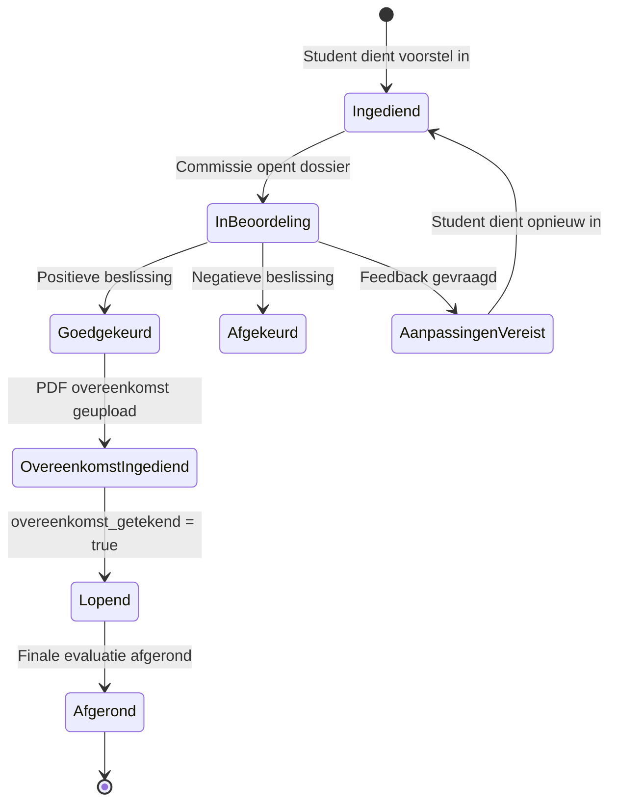
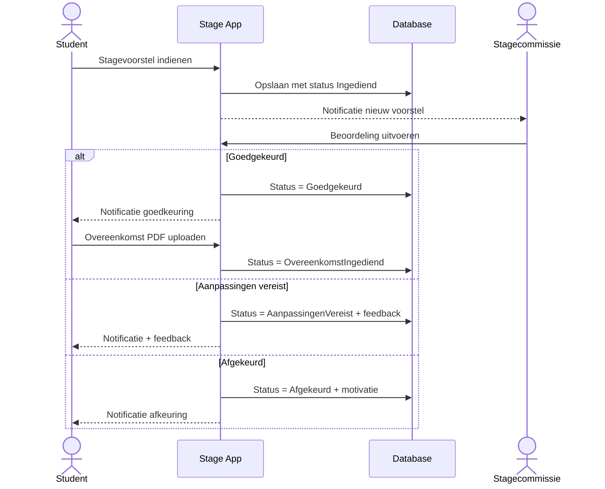
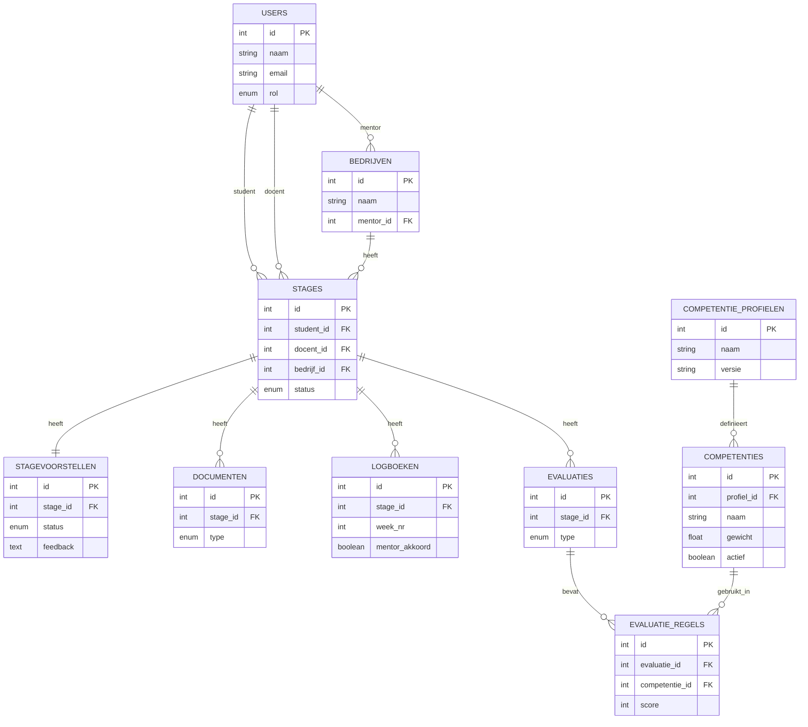

# Stage Monitoring Tool - Analyse

Analyse document - Juan Benjumea  
Projectanalyse - 14/03/2026

## 1. Projectkader

### 1.1 Probleemcontext

Het huidige stageproces heeft vijf kernproblemen:

| Pijnpunt | Gevolg |
|---|---|
| Versnippering | Gegevens en documenten zitten verspreid over mail en losse formulieren. |
| Beperkte transparantie | Stakeholders missen een centraal overzicht van status en voortgang. |
| Inefficiente communicatie | Veel manuele opvolging via mail tussen student, commissie, docent en mentor. |
| Handmatige monitoring | Wekelijkse opvolging gebeurt niet uniform en kost veel tijd. |
| Statische evaluatiecriteria | Aanpassingen in competenties vragen codewijzigingen. |

### 1.2 Doelstellingen

| # | Doelstelling | Concreet effect |
|---|---|---|
| 1 | Centralisatie | Alle stagegegevens op een platform met dossierhistoriek. |
| 2 | Transparantie | Voor elke rol een helder statusoverzicht per stage. |
| 3 | Efficientie | Automatische notificaties en validaties in plaats van ad-hoc mail. |
| 4 | Wendbaarheid | Competenties en gewichten configureerbaar zonder deploy. |
| 5 | Traceerbaarheid | Audit trail van beslissingen, uploads en evaluaties. |

### 1.3 Scope

In scope:
- Stagevoorstel en goedkeuringsflow
- Overeenkomstbeheer en administratieve validatie
- Wekelijkse logboeken met feedback
- Tussentijdse en finale evaluaties per competentie
- Beheer van competentieprofielen en gewichten

Out of scope (voor dit project):
- Integratie met externe schoolplatformen
- Geavanceerde BI dashboards buiten rapportexport

## 2. Stakeholders en Rollen

| Rol | Kernverantwoordelijkheden |
|---|---|
| Student | Stage aanvragen, overeenkomst uploaden, logboeken invullen, evaluaties raadplegen. |
| Stagecommissie | Voorstellen beoordelen, status beslissen, feedback geven. |
| Docent | Logboeken opvolgen, tussentijdse/finale evaluaties invullen, eindrapport valideren. |
| Stagementor | Wekelijkse logboeken aftekenen, feedback per competentie geven. |
| Administratie | Gebruikersbeheer, competentieprofielen beheren, rapportages exporteren. |

### 2.1 Rollenmatrix (rechten per procesdeel)

| Rol | Aanvraag | Beoordeling | Overeenkomst | Logboeken | Evaluatie | Configuratie |
|---|---|---|---|---|---|---|
| Student | Create/Read | Read | Upload/Read | Create/Read | Read | None |
| Stagecommissie | Read | Update status + feedback | Read/Validate | Read | Read | None |
| Docent | Read | Read | Read | Read/Comment | Create/Update | None |
| Stagementor | Read | Read | Read | Read/Verify | Create/Update | None |
| Administratie | Read | Read | Read | Read | Read | Full CRUD |

## 3. End-to-End Procesflow

### 3.1 Procesfasen

| Fase | Actor(en) | Output |
|---|---|---|
| 1. Aanvraag | Student | Stagevoorstel met status Ingediend |
| 2. Beoordeling | Stagecommissie | Status: Goedgekeurd, Afgekeurd, of Aanpassingen vereist |
| 3. Overeenkomst | Student + Stagecommissie/Administratie | Overeenkomst ingediend en gevalideerd |
| 4. Opvolging | Student + Docent + Mentor | Wekelijkse logboeken en feedback |
| 5. Evaluatie | Docent + Mentor | Tussentijdse/finale evaluatie en eindrapport |

### 3.2 Statusmodel (state machine)

### 3.3 Kritische business rules

- Alleen de stagecommissie mag de voorstelstatus wijzigen tijdens beoordeling.
- Overgang naar Lopend kan alleen als overeenkomst_getekend = true.
- Bij Aanpassingen vereist is feedback verplicht.
- Een finale evaluatie is na afsluiten niet meer wijzigbaar.
- Alle statuswijzigingen, evaluaties en documentacties worden geaudit (tijdstip + actor).

### 3.4 Kernsequentie: aanvraag tot start

## 4. Functionele Vereisten

### 4.1 User stories (overzicht)

| ID | User story | Prioriteit | Fase |
|---|---|---|---|
| US-01 | Als student wil ik een stagevoorstel indienen met bedrijfs- en opdrachtgegevens zodat de stagecommissie kan beoordelen. | Must | Aanvraag |
| US-02 | Als student wil ik de status van mijn stagevoorstel bekijken zodat ik de voortgang ken. | Must | Beoordeling |
| US-03 | Als student wil ik feedback ontvangen bij afkeuring of aanpassingen zodat ik mijn voorstel kan verbeteren. | Must | Beoordeling |
| US-04 | Als student wil ik een getekende stageovereenkomst uploaden zodat administratie en verzekering in orde zijn. | Must | Overeenkomst |
| US-05 | Als student wil ik wekelijks een logboek invullen met taken en reflecties zodat docent en mentor mijn voortgang volgen. | Must | Opvolging |
| US-06 | Als student wil ik vorderingen per competentie beschrijven zodat evaluatie transparant verloopt. | Must | Opvolging |
| US-07 | Als student wil ik feedback van docent/mentor lezen zodat ik gericht kan bijsturen. | Must | Opvolging |
| US-08 | Als student wil ik een historiek van mijn logboeken zien zodat ik mijn evolutie kan opvolgen. | Should | Opvolging |
| US-09 | Als student wil ik mijn eindevaluatierapport raadplegen zodat ik mijn finale beoordeling ken. | Should | Evaluatie |
| US-10 | Als stagecommissielid wil ik een lijst van voorstellen zien zodat ik kan beoordelen. | Must | Aanvraag |
| US-11 | Als stagecommissielid wil ik voorstellen goedkeuren, afkeuren of aanpassingen vragen zodat kwaliteit gewaarborgd blijft. | Must | Beoordeling |
| US-12 | Als stagecommissielid wil ik feedback meegeven bij beslissingen zodat de student weet wat te wijzigen. | Must | Beoordeling |
| US-13 | Als stagecommissielid wil ik controleren of de overeenkomst is opgeladen zodat verzekering gegarandeerd is. | Must | Overeenkomst |
| US-14 | Als stagecommissielid wil ik overzicht van alle stages en statussen zodat het proces monitorbaar blijft. | Should | Opvolging |
| US-15 | Als docent wil ik wekelijkse logboeken inzien en opvolgen zodat ik gericht kan coachen. | Must | Opvolging |
| US-16 | Als docent wil ik feedback per competentie geven zodat studenten weten waar ze staan. | Must | Opvolging |
| US-17 | Als docent wil ik een tussentijdse evaluatie registreren zodat formele feedbackmomenten bestaan. | Must | Opvolging |
| US-18 | Als docent wil ik de finale evaluatie invullen met score per competentie zodat de eindbeoordeling correct is. | Must | Evaluatie |
| US-19 | Als docent wil ik een eindoverzicht per student genereren zodat administratie kan rapporteren. | Must | Evaluatie |
| US-20 | Als docent wil ik notificatie ontvangen bij nieuwe logboeken zodat ik tijdig reageer. | Should | Opvolging |
| US-21 | Als stagementor wil ik wekelijks logboeken inkijken zodat ik voortgang valideer. | Must | Opvolging |
| US-22 | Als stagementor wil ik logboeken aftekenen zodat opvolging aantoonbaar is. | Must | Opvolging |
| US-23 | Als stagementor wil ik feedback per competentie geven zodat de evaluatie volledig is. | Must | Evaluatie |
| US-24 | Als stagementor wil ik overzicht van stagecontext zien zodat ik goede begeleiding kan geven. | Should | Aanvraag |
| US-25 | Als administratie wil ik competenties en gewichten beheren zonder codewijzigingen zodat evaluatie wendbaar blijft. | Must | Evaluatie |
| US-26 | Als administratie wil ik gewichten van competenties instellen zodat de eindscore correct wordt berekend. | Must | Evaluatie |
| US-27 | Als administratie wil ik gebruikers beheren zodat toegang correct geregeld is. | Must | Alle |
| US-28 | Als administratie wil ik rapportages exporteren zodat data bruikbaar is voor rapportering. | Could | Evaluatie |

### 4.2 MoSCoW schaal

| Prioriteit | Betekenis |
|---|---|
| Must | Kritisch voor een werkend systeem |
| Should | Belangrijke meerwaarde |
| Could | Extra waarde indien tijd beschikbaar |
| Won't | Buiten scope van dit project |

### 4.3 Kritische acceptatiecriteria

US-01 - Stagevoorstel indienen
- Formulier valideert verplichte velden (student, bedrijf, docent, opdracht, periode).
- Na indienen krijgt dossier status Ingediend.
- Student krijgt bevestiging; commissie krijgt notificatie.

US-04 - Overeenkomst uploaden
- Alleen PDF toegestaan.
- Uploaddatum wordt opgeslagen.
- Status wijzigt naar OvereenkomstIngediend.
- Enkel bevoegde rollen hebben toegang.

US-05 - Wekelijks logboek
- Per student maximaal een logboek per weeknummer.
- Na indiening zichtbaar voor toegewezen docent en mentor.
- Mentor kan logboek aftekenen.
- Ontbrekende weken worden gemarkeerd.

US-11 - Beoordeling voorstel
- Mogelijke beslissingen: Goedgekeurd, Afgekeurd, AanpassingenVereist.
- Bij AanpassingenVereist is feedback verplicht.
- Student krijgt notificatie bij elke statuswijziging.

US-18 - Finale evaluatie
- Score per actieve competentie.
- Docent en mentor kunnen afzonderlijk scoren.
- Gewogen eindscore wordt automatisch berekend.
- Na afsluiten geen wijzigingen meer mogelijk.

US-25 - Competenties beheren
- Competentie bevat naam, beschrijving, gewicht en actief-status.
- Bij opslaan geldt validatie: som gewichten = 100%.
- Wijzigingen gelden enkel voor nieuwe stageperiodes.
- Historische evaluaties blijven ongewijzigd.

## 5. Domeinmodel en Data

### 5.1 Kernentiteiten

| Entiteit | Belangrijkste velden |
|---|---|
| users | id, naam, email (unique), rol, created_at |
| bedrijven | id, naam, adres, sector, mentor_id |
| stages | id, student_id, docent_id, bedrijf_id, periode_start, periode_end, status |
| stagevoorstellen | id, stage_id, omschrijving, status, feedback, ingediend_op |
| documenten | id, stage_id, type, bestandspad, geupload_op |
| logboeken | id, stage_id, week_nr, taken, reflectie, problemen, mentor_akkoord |
| competentie_profielen | id, naam, versie, actief |
| competenties | id, profiel_id, naam, beschrijving, gewicht, type, actief |
| evaluaties | id, stage_id, type, datum, ingediend_door |
| evaluatie_regels | id, evaluatie_id, competentie_id, score, feedback_docent, feedback_mentor |

### 5.2 Constraints

- users.email is uniek.
- logboeken.week_nr in bereik 1..52.
- evaluatie_regels.score in bereik 1..5.
- competenties.gewicht in bereik 0..100.
- Per actief profiel geldt: som van alle competentiegewichten = 100%.

### 5.3 ERD (samengevat)

## 6. Architectuurkeuze

### 6.1 Gelaagde architectuur

| Laag | Keuze | Motivatie |
|---|---|---|
| Frontend | React of Vue + Tailwind | Snelle componentgebaseerde UI ontwikkeling voor meerdere rollen |
| Backend API | Node.js of FastAPI (REST) | Heldere business logica met rolautorisatie |
| Database | PostgreSQL of MySQL | Relationeel model sluit aan op stages, evaluaties en historie |
| Auth | JWT (access/refresh) | Praktische sessiebeveiliging voor webapp |
| Notificatie | E-mail service | Statuswijzigingen en deadlines automatisch communiceren |

### 6.2 Flexibele competenties (configuratief)

Doel: evaluatiecriteria jaarlijks aanpassen zonder codewijziging.

Gekozen aanpak:
- CompetentieProfiel per opleiding/jaar (versiebeheer)
- Competenties per profiel met gewicht en actief-status
- EvaluatieRegels gekoppeld aan competenties op evaluatiemoment

Waarom deze keuze:
- Wendbaar: nieuwe competentie zonder deploy
- Historisch correct: oude evaluaties blijven bij oud profiel
- Valideerbaar: gewichten technisch afdwingbaar op 100%

## 7. Planning en Oplevering

### 7.1 Productbacklog per sprint

| Sprint | Focus | Output |
|---|---|---|
| Sprint 1 | Kerninfrastructuur + stagevoorstel | Rollen/rechten, aanvraag, beoordeling, feedback |
| Sprint 2 | Overeenkomst + logboeken | PDF upload/validatie, weeklogboeken, mentor-ack |
| Sprint 3 | Evaluaties + competenties | Competentiebeheer, tussentijds/finaal scoren |
| Sprint 4 | Meldingen + rapportage + afronding | Notificaties, exports, polish en bugfixing |

### 7.2 Definition of Done

Een user story is pas Done wanneer:
- Code gereviewd is door minstens 1 teamlid
- Test slagen
- Geen critical bugs open staan
- Validaties en foutmeldingen aanwezig zijn
- Documentatie is bijgewerkt

## 8. UX Scope (samengevat)

### 8.1 Belangrijkste schermen

| Scherm | Rol | Doel |
|---|---|---|
| Student dashboard | Student | Status, open taken, logboekhistoriek |
| Stageaanvraag formulier | Student | Nieuwe aanvraag met validatie |
| Commissie dashboard | Stagecommissie | Beoordelen en feedback geven |
| Docent dashboard | Docent | Missing logs, evaluaties, opvolging |
| Evaluatieformulier | Docent/Mentor | Score en feedback per competentie |
| Competentiebeheer | Administratie | Profielen en gewichten beheren |

### 8.2 Hoofdinteracties

Flow 1 - Aanvraag:
Student -> Formulier invullen -> Valideren -> Opslaan -> Notificatie commissie

Flow 2 - Beoordeling:
Commissie -> Voorstel openen -> Beslissing kiezen -> Feedback opslaan -> Notificatie student

Flow 3 - Opvolging:
Student -> Weeklogboek indienen -> Notificatie docent/mentor -> Mentor valideert

Flow 4 - Evaluatie:
Docent/Mentor -> Evaluatietype kiezen -> Score per competentie -> Gewogen score -> Rapport beschikbaar
